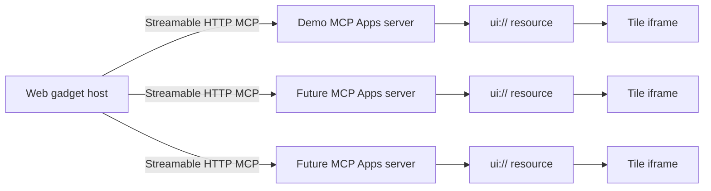

# MCP App Gadgets experiment

## Goal

Validate whether a generic web host can compose a dashboard from independently deployed MCP Apps without implementing a bespoke UI integration for each tile.

## Hypothesis

A gadget can be represented as `{serverUrl, toolName, arguments, title, layout}`. The host discovers tools whose metadata points to a `ui://` resource, calls the selected tool with tile-specific arguments, reads the UI resource, and mounts the resulting MCP App in an isolated iframe. Adding a new visualization then requires deploying an MCP Apps server rather than modifying the host.

## POC architecture



Each tile owns its MCP tool input/result lifecycle. Each MCP server is independently deployable and is isolated at the process/container boundary in Docker Compose.

## POC scope

- Discover MCP App tools from a Streamable HTTP MCP endpoint.
- Create multiple tiles from arbitrary MCP App tools.
- Pass JSON arguments per tile.
- Render each app in a sandboxed iframe through `AppBridge`.
- Run the host and one parameterized example server with Docker Compose.
- Keep gadget persistence, authentication, authorization, secret handling, drag/resizing, and production-grade sandbox/CSP enforcement out of the first experiment.

## Security boundary

The POC iframe intentionally uses a minimal `sandbox="allow-scripts allow-forms"` policy and does not grant same-origin access. This is useful for validating composition, but production should adopt the MCP Apps reference host's double-iframe sandbox proxy, CSP/permission metadata enforcement, strict origin validation, and per-server trust policy.

Do not send credentials or sensitive data to arbitrary MCP endpoints. A production host must add an endpoint allowlist or explicit trust prompt, authentication/token delegation, SSRF controls, CSP enforcement, audit logging, and egress policy.

## Run

```bash
docker compose up --build
```

Open `http://localhost:8080`, keep the default server URL `http://localhost:3001/mcp`, click **Discover apps**, then add the metric gadget with custom JSON arguments.

## Next experiment

Persist a gadget document containing only configuration and layout (not MCP results), then reconnect and refresh every tile from its MCP server. This tests the intended separation: the host owns composition, while MCP Apps own UI and live data behavior.
