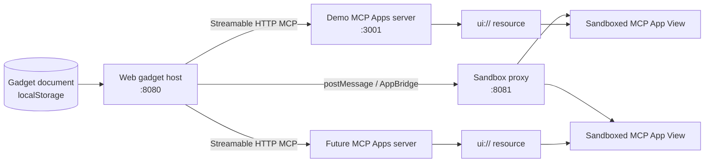

# MCP App Gadgets experiment

## Goal

Validate whether a generic web host can compose a dashboard from independently deployed MCP Apps without implementing a bespoke UI integration for each tile.

## Hypothesis

A gadget can be represented as `{id, serverUrl, toolName, arguments, title, layout}`. The host persists only that configuration, discovers tools whose metadata points to a `ui://` resource, calls the selected tool with tile-specific arguments, reads the UI resource, and mounts the resulting MCP App in an isolated View. Adding a new visualization then requires deploying an MCP Apps server rather than modifying the host.

## Implemented architecture



The host and sandbox proxy use different origins. Each MCP endpoint gets its own cached client connection. Each gadget owns its tool input/result lifecycle, while MCP servers remain independently deployable and process/container isolated.

## Completed experiments

### 1. Real Compose + Playwright path

`tests/e2e/gadgets.spec.ts` verifies the actual topology rather than mocking MCP:

1. connect from the browser to the demo Streamable HTTP MCP endpoint;
2. discover the MCP App tool;
3. create two instances of the same tool with different JSON arguments;
4. render through Host → sandbox proxy → inner View;
5. reload the page;
6. restore both gadgets from persisted configuration and refetch live tool results.

The scenario is executable with the Compose `e2e` profile and runs in GitHub Actions.

### 2. Reference-shaped MCP Apps sandboxing

The host no longer injects arbitrary MCP App HTML directly into its own iframe. It instead loads a sandbox proxy from port 8081. The proxy:

- validates that its embedding host uses the same hostname on port 8080;
- runs on a different origin from the host;
- creates an inner sandboxed View;
- relays MCP Apps messages between Host and View;
- propagates requested permissions through the iframe `allow` attribute;
- receives resource CSP metadata via the sandbox URL and enforces it using the HTTP `Content-Security-Policy` response header;
- rejects unrelated paths on the sandbox origin.

This follows the security shape of the MCP Apps reference host while remaining intentionally small.

### 3. Persisted gadget documents

The browser persists a versioned document in `localStorage` containing gadget configuration only. MCP tool results and rendered HTML are deliberately not persisted.

On reload, each gadget reconnects to its MCP endpoint, rediscovers the configured tool, reads its current UI resource, and invokes the tool again. Failure is isolated per gadget: a removed tool or unavailable server produces an unavailable tile rather than breaking the rest of the document.

## Current data model

```ts
interface GadgetDocument {
  version: 1;
  gadgets: Array<{
    id: string;
    serverUrl: string;
    toolName: string;
    title: string;
    arguments: Record<string, unknown>;
    layout?: {
      width?: number;
      height?: number;
    };
  }>;
}
```

`layout` is reserved for the next composition experiment; drag/resize is not implemented yet.

## Run

```bash
docker compose up --build
```

Open `http://localhost:8080`, keep the default server URL `http://localhost:3001/mcp`, click **Discover apps**, and add metric gadgets with different arguments.

Run the end-to-end test with:

```bash
docker compose up -d --build gadget-host demo-mcp-app
docker compose --profile e2e run --rm e2e
docker compose down --volumes --remove-orphans
```

## Remaining production boundaries

The sandbox reduces View risk, but it does not make arbitrary MCP endpoints trustworthy. A production deployment still needs:

- endpoint registration, allowlisting, or explicit trust UX;
- OAuth/token delegation and per-user authorization;
- secret isolation;
- SSRF protection for any future server-side connection proxy;
- audit logging and policy enforcement;
- deployment-specific allowed origins rather than the experiment's hostname/port rule;
- outbound egress controls;
- gadget document schema validation and migration;
- quotas, timeouts, cancellation, and resource lifecycle limits.

## Next experiment

Add layout editing (drag, resize, responsive breakpoints) without introducing tile-type-specific UI code. The acceptance criterion should remain: a new MCP App server can add a completely new tile UI without changing the host runtime.
